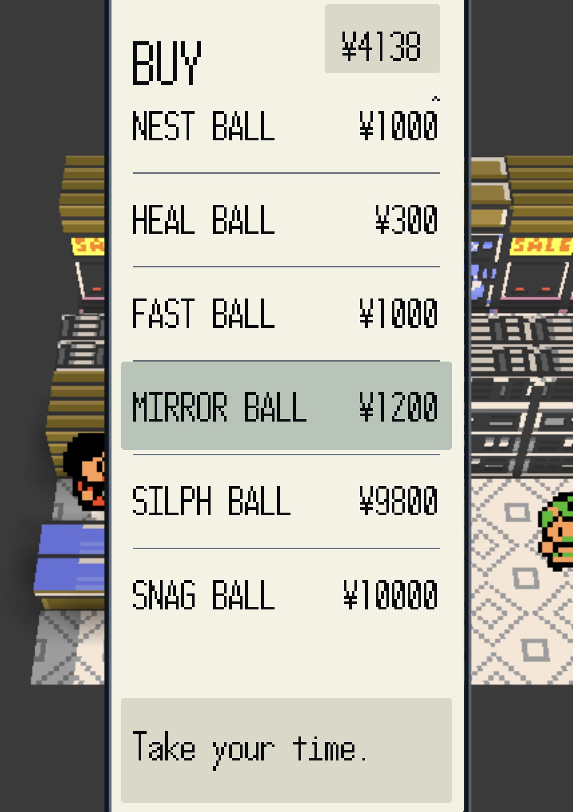
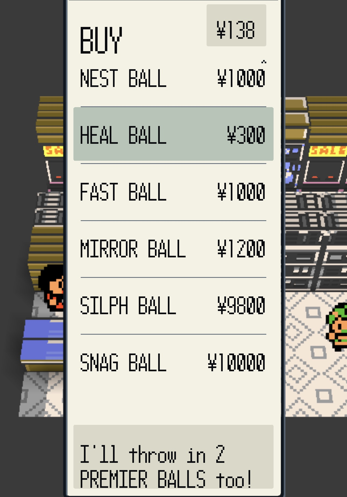
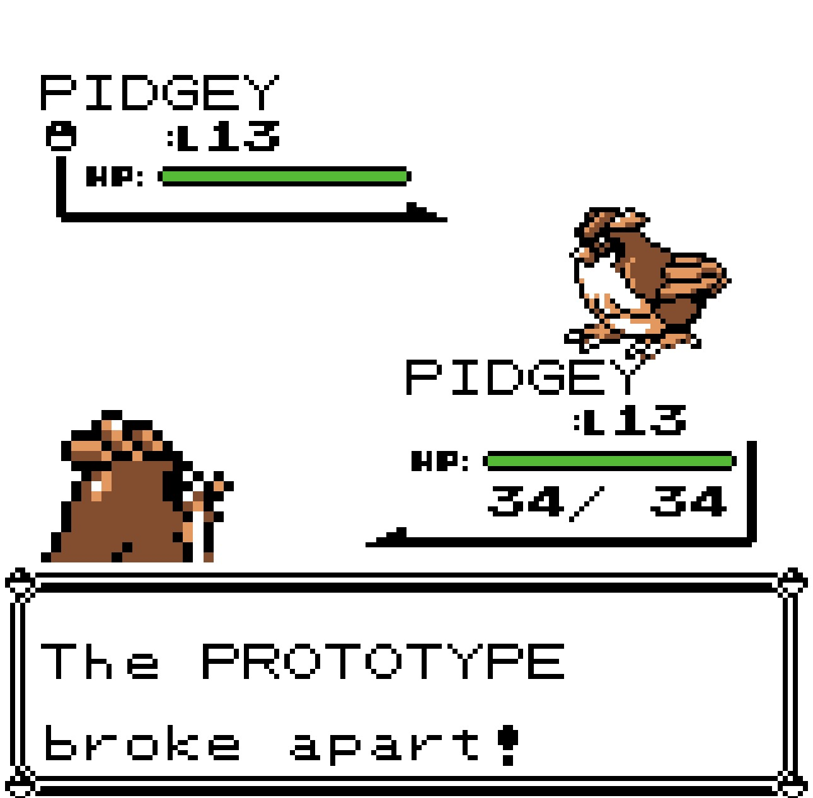
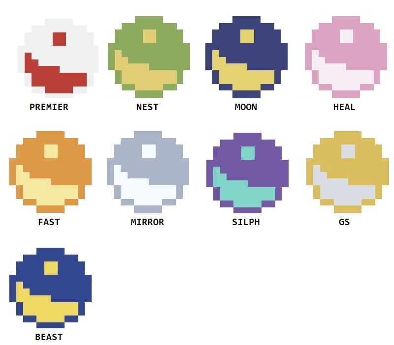

# Too Many Balls

**New Poké Balls for gen1recomp** — on Red / Blue / Yellow **and Pokémon
Gold** since 0.4.0 — sold on real mart shelves, plus the small library mod
that makes one of them possible.

*(Called **Kanto Balls** until 0.4.3. Renamed once the balls reached
Johto and "Kanto" stopped being true. Same mod, same ids, same downloads —
see [Installation](#installation).)*

| Ball | Where you get it | What makes it worth carrying |
| ---- | ---------------- | ---------------------------- |
| **PREMIER BALL** | **Free.** Buy 10+ balls in one purchase and the clerk throws one in per 10 | Plain Poké Ball odds — but you never pay for one, and the clerk says so in his own text box |
| **NEST BALL** | Ball marts, ₽1000 | **4×** on anything level 15 or under, tapering off up to 35 |
| **MOON BALL** | Pewter Mart — the last mart before Mt. Moon | **4×** on anything that evolves by Moon Stone |
| **HEAL BALL** | Ball marts, ₽300 | Normal odds, but what you catch arrives **fully healed** — HP, status and PP |
| **FAST BALL** | Ball marts, ₽1000 | **4×** on anything with base Speed 100+ — the birds, Dugtrio, Electrode, Tauros, Jolteon |
| **MIRROR BALL** | Ball marts, ₽1200 | **4×** when the wild Pokémon is the same species as the one you have out. Send out your own Pidgey to catch a better Pidgey |
| **SILPH BALL** | Saffron Mart, ₽9800 | Silph Co's abandoned first pass at the Master Ball. When it works, it **is** a Master Ball. One throw in two, it just breaks |

Every ball is a real item on a real shelf — no cheats, no menu, no new
currency. Buy them and throw them.

**On Pokémon Gold**, five of them travel: Premier, Nest, Heal, Mirror and
the prototype (labelled **PROTO BALL** there, since Silph Co doesn't exist
in Johto). They're sold at marts that already stock Great or Ultra Balls,
sort into the BALLS pocket, and each has its own colour when thrown. Moon
and Fast stay behind — Gold already has its own, made by Kurt.

*(The SNAG BALL on that shelf is from [Pokemon Snag](https://github.com/mistermiracle3036/Pokemon-Snag),
a separate mod of mine — it is not part of this one.)*

### The Premier Ball pays for itself

Buy ten or more of any ball in **one** purchase and the clerk hands them
over free, and says so in his own text box:

### The Silph Ball tells you when it breaks

A failed throw is not a miss, and it does not pretend to be one:

## Two mods, one download page

| Mod | What it does |
| --- | --- |
| **[kanto_balls](kanto_balls/)** | The seven balls above. **Requires shop_events.** |
| **[shop_events](shop_events/)** | Library mod. Emits `shop.purchased` whenever you buy something at a mart, because the engine has no purchase event of its own. Does nothing visible by itself. |

**Install both**, even if you only want the balls — the Premier Ball's
bonus is built entirely on shop_events.

> **Development Preview:** both mods are in active development. Bug
> reports and ideas are welcome in [Issues](../../issues) — say which
> mod, include the version from your load log, and list your other mods.

## Also for mod authors

`kanto_balls/main.lua` is written to be read and copied. The seven balls
are seven *different* techniques, deliberately: no catch code at all,
reacting to another mod's event, multiplying the rate from live battle
state, querying species data, reading base stats, reading your own side of
the battle, and replacing the catch roll outright. Each one is commented
with the engine file and line it was verified against.

Between them they cover most of what the ball API can do, which is why
this started life as **Example Balls**.

## Installation

1. Download **both** zips from the [latest release](../../releases/latest):
   `kanto_balls-X.Y.Z.zip` and `shop_events-X.Y.Z.zip`.
2. Launcher → **MODS** → **Import mod .zip**, once per zip.
3. Fully quit and relaunch.

**Upgrading from Kanto Balls?** Nothing to do — that was this mod's old
display name (changed at 0.4.3). The id never changed, so the mod browser
updates it in place and your saved balls are untouched.

Already have **Example Balls** (`example_balls`) installed? Remove it
first. That one was a real id change back at 0.2.0, and because a new id
installs to its own folder, nothing stops both running at once and
registering overlapping balls.

## Why one repo, two mods

They're released together, but they're **not one mod** — each has its own
manifest, its own id, and its own on/off toggle in the mod browser.
shop_events is meant to be reusable by other authors independent of the
ball pack, so keeping it a separate install matters.

The one consequence of sharing a repo: **every release retags and re-zips
both mods to the same version number**, even when only one of them
actually changed. See each mod's CHANGELOG for why.

## Compatibility

- **[Pokeball Colors](https://github.com/mistermiracle3036/Pokeball-Colors)** —
  optional, **Gen 1 only**. Every ball registers its own colors when it is
  installed, so each one has its own look during the throw. (On Gold this
  mod supplies its own ball colours directly — Pokeball Colors isn't
  needed and isn't loaded there.)

  

  *Requires Pokeball Colors with **COLORS** set to ADVANCED — without it
  every ball throws in the default palette. GS and BEAST are the two
  behind `[DEV] CHEAP BALLS`.*
- **[Custom Poké Balls](https://github.com/magalvao/custom-pokeballs)**
  by magalvao — coexists. Both append to the same mart shelves and no
  ball is duplicated between them.
- Mart shelves are verified present in Red, Blue **and** Yellow's data,
  but have only been played on Red/Blue so far.

## Credits

By **Mister Miracle**
([@mistermiracle3036](https://github.com/mistermiracle3036)).
Built for [gen1recomp](https://github.com/bryanthaboi/gen1recomp).
See [THIRD_PARTY_NOTICES.md](THIRD_PARTY_NOTICES.md).
